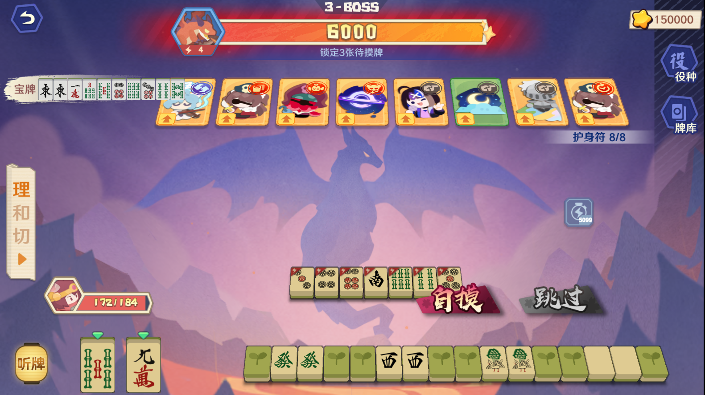
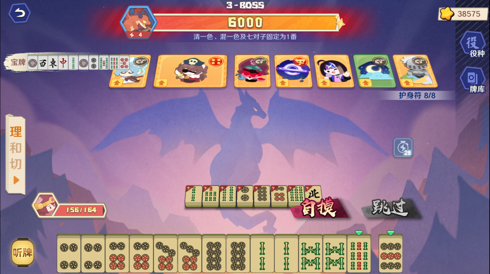

# 雀魂青云之志S4自动刷分脚本

1920×1080 分辨率下自动识别牌面、匹配目标牌、点击自摸/跳过的 Python 脚本。

**tsumo19d.py** 适用于卡片阵容1（冬实效果的牌触发自摸，其余触发跳过）：



**auto_clicker.py** 适用于卡片阵容2：



## 原理

1. **截图** — 每轮循环合并截取牌面 + 分数区域（175×223），mss 直接返回 ndarray 后切片取出两个 ROI
2. **卡住检测** — 每轮比较当前牌面截图与上一轮，连续 3 次相同则鼠标悬停跳过按钮重新截图，仍相同则播放 10 次警告音（每次间隔 1s）后触发重连（`relaunch.run`，先于先决条件，始终运行）
3. **先决条件检测** — `cv2.matchTemplate(TM_CCOEFF_NORMED)` 匹配 `precondition.png`，不满足时跳过本轮（控制重试）
4. **ORB 特征匹配** — 对牌面 ROI 提取 ORB 特征点；与预设的目标/干扰模板进行 BFMatcher 交叉匹配，取好匹配数（Hamming < 50）最多的模板（无重试，一次出结果）
5. **网络断连检测** — 记录每轮 ORB 识别结果 `(name, is_target)`，连续 5 次相同时截取 (645,405)–(1275,765) 区域与 `net_reset.png` 模板匹配；匹配则直接重连（`relaunch.run`），否则继续正常流程
6. **决策** — 最佳模板的匹配数 ≥ 阈值(20) 且是目标牌 → 点自摸；否则点跳过
7. **分数检测** — Tesseract OCR（灰度图 bilateralFilter 降噪保边，2 倍放大，Otsu 二值化，PSM 7）读取分数（格式 `abc/{total}`），`abc > total` 或格式不符时视为无效重试；分数大幅下降时连续两次一致即接受；低于 `NUM_ALARM(105)` 时报警
8. **连点** — 自摸后连点屏幕中心跳过结算页面

## 环境要求

- Python ≥3.14
- Windows（使用了 `winsound`、`ctypes`、`keyboard` 等 Windows 特有库）
- Tesseract-OCR 5.4.0+
- 屏幕分辨率 **1920×1080**，游戏窗口全屏

### 安装依赖

```bash
uv sync
```

手动安装 Tesseract-OCR：
https://github.com/UB-Mannheim/tesseract/releases

## 使用

```bash
uv run python tsumo19d.py           # 静默运行（无信息窗口）
uv run python tsumo19d.py --debug   # 带 Tkinter 调试窗口
uv run python zi.py                 # 字牌自摸/跳过（无信息窗口）
uv run python zi.py --debug         # 字牌自摸/跳过（带调试日志）
uv run python auto_clicker.py       # 连点器（自动重启）
uv run python cloud_bottle.py       # 刷印章连点器（w 键暂停）
```

运行后弹出确认窗口，点击"确定"开始运行，"取消"则安全退出。

### 控制

| 按键 | 功能 |
|------|------|
| `Ctrl+.` | 暂停（弹窗确定继续 / 取消退出） |
| `w` | cloud_bottle 暂停/恢复 |
| 关闭控制台窗口 | 停止程序 |

## 模板配置

### 目录结构

```
consts.py              # 全部常量（坐标、阈值、路径）
capture.py             # 截屏（mss，合并 175×223 区域）
tile_matcher.py        # 牌型匹配（ORB 特征 + BFMatcher，模板加载）
score_reader.py        # 分数检测（Tesseract OCR，含 debug 截图）
actions.py             # 点击动作（自摸/跳过）
relaunch.py            # 重连模块（卡住时刷新游戏并等待回归）
ui.py                  # 用户交互（报警、暂停弹窗、debug 窗口）
tsumo19d.py            # 入口，主循环（仅自摸1/9序数牌和dong）
zi.py                  # 字牌自摸/跳过（匹配 pics/zi* 则跳过，否则自摸）
auto_clicker.py        # 连点器（自动定时重启，含先决条件判定）
speedhack.py           # CE加速模块（自动打开CE，OCR匹配firefox PID，设置5倍速）
cloud_bottle.py        # 刷印章连点器（w 键暂停/恢复，暂停时悬停自摸坐标）
pics/
├── targets/          # 目标牌模板（触发自摸）
│   ├── 1m.png
│   ├── 1p.png
│   ├── 9m.png
│   ├── 9p.png
│   ├── 9s.png
│   └── dong.png
├── distractors/      # 干扰牌模板（触发跳过）
│   ├── 7p.png
│   └── 7s.png
├── zi/               # 字牌模板（触发跳过）
│   ├── bai.png
│   ├── bei.png
│   ├── dong.png
│   ├── fa.png
│   ├── nan.png
│   ├── xi.png
│   └── zhong.png
├── relaunch/         # 重连匹配模板
│   ├── qyzz1.png
│   ├── qyzz2.png
│   └── continue.png
├── net_reset.png     # 网络断开画面模板
├── precondition.png  # 先决条件模板（tsumo19d）
├── pre1.png          # 先决条件模板1（zi/auto_clicker）
└── pre2.png          # 先决条件模板2（zi/auto_clicker，任一匹配即通过）
tools/
├── mouse_pos.py       # 坐标捕获工具
└── threshold_test.py  # 阈值检测测试工具
```

模板保持原始像素尺寸，ORB 在加载时自动提取特征点。

### 目标牌

`1m`（一萬）、`9m`（九萬）、`9s`（九條）、`1p`（一筒）、`9p`（九筒）、`dong`（東）

## 坐标配置

所有坐标基于 **1920×1080** 全屏：

| 常量 | 坐标 | 说明 |
|------|------|------|
| `TILE_REGION` | (450, 885, 90, 140) | 牌面截图区域 (left, top, width, height) |
| `NUM_REGION` | (365, 805, 125, 30) | 分数数字区域 |
| `CENTER` | (960, 540) | 屏幕中心（连点/鼠标复位） |
| `TSUMO_BTN` | (1200, 820) | 自摸按钮 |
| `SKIP_BTN` | (500, 950) | 跳过按钮 |
| `RELAUNCH_QYZZ_REGION` | (1635, 600, 110, 100) | qyzz 检测区域 |
| `RELAUNCH_QYZZ_CLICK` | (1695, 655) | qyzz 按钮 |
| `RELAUNCH_CONTINUE_REGION` | (795, 860, 330, 90) | continue 检测区域 |
| `RELAUNCH_CONTINUE_CLICK` | (870, 900) | continue 按钮 |
| `RELAUNCH_PRECOND_REGION` | (475, 885, 35, 20) | 重连完成先决条件检测区域 |
| `NET_RESET_REGION` | (645, 405, 630, 360) | 网络断连检测区域 |

## 阈值说明

| 常量 | 默认值 | 说明 |
|------|--------|------|
| `THRESHOLD_DEFAULT` | 20 | 全局匹配数阈值 |
| `NUM_ALARM` | 105 | 分数低于该值时报警暂停 |
| `RETRY_LIMIT` | 5 | OCR 分数异常重试上限 |
| `LOOP_SLEEP` | 1.0 | 每轮循环间隔（秒） |
| `SLEEP_INTERVAL` | 0.2 | 检测/重试刷新间隔（秒） |
| `PRECONDITION_THRESHOLD` | 0.9 | 先决条件匹配阈值（TM_CCOEFF_NORMED，范围 0~1） |
| `RELAUNCH_THRESHOLD` | 0.9 | 重连画面匹配阈值 |
| `RELAUNCH_INTERVAL` | 10 | 重连重试间隔（秒） |
| `RELAUNCH_DIR` | `pics/relaunch/` | 重连模板目录 |
| `NET_RESET_THRESHOLD` | 0.9 | 网络断连画面匹配阈值 |

阈值是 **好匹配数**（BFMatcher 交叉匹配中 Hamming 距离 < 50 的匹配对数）。模板特征总数越多，理论上可达的匹配数越高。

## 详细流程

```
┌─────────────┐
│ 加载模板     │  读取 targets/ 和 distractors/ 下的图片，
│ 提取特征点   │  用 ORB 提取特征描述子
└──────┬──────┘
       ↓
┌─────────────┐
│ 弹窗确认     │  点击确认后开始运行
└──────┬──────┘
       ↓
┌─────────────┐  ─── 循环开始 ───
│ 鼠标移至中心 │  (960,540)
├─────────────┤
│ 合并截屏     │  175×223（mss），切片取牌面 + 分数 ROI
├─────────────┤
│ 卡住检测     │  与上一轮截图比较，连续3次时悬停
│             │  跳过按钮重截图；仍相同则播放10次警告音后重连
├─────────────┤
│ 先决条件检测 │  TM_CCOEFF_NORMED 匹配
│             │  不满足 → 跳过本轮（重试）
├─────────────┤
│ ORB 特征匹配 │  对所有模板计算好匹配数，取最高者
│             │  无重试，一次出结果
├─────────────┤
│ 网络断连检测 │  记录识别结果，连续5次相同时
│             │  截图对比 net_reset.png；匹配则重连
├─────────────┤
│ OCR 读取分数 │  格式 abc/{total}，3 倍放大后识别
│             │  分数大幅下降时等待稳定（连续两次相同）
│             │  < NUM_ALARM → 报警
├─────────────┤
│ 决策         │  最佳模板是目标 且 匹配数≥阈值(20)
│             │  → 自摸        → 跳过
└──────┬──────┘  └──────┬──────┘
       │                │
       │ 1. 移到自摸按钮 │ 1. 移到跳过按钮
       │ 2. 点击        │ 2. 点击
       │ 3. 连点屏幕中心 │ 3. 鼠标复位中心
       └────────────────┘
       ↓
     休眠 1.0 秒 → 循环继续
```

## 分数检测与报警

- **OCR 未读到分数**（返回 `---`）：跳过本轮，下一轮重新检测
- **低分报警**：当解析到分数 `cur < NUM_ALARM(105)` 时，立即触发报警并 `continue`
- **分数异常**（大幅下降/不稳定）：`check_number()` 内部重试等待稳定，连续 `RETRY_LIMIT(5)` 次均异常则触发报警

报警流程：

1. 打印运行时间 `[HH:MM:SS] 报警: <消息>`
2. 响五声提示音（660Hz × 5）后接系统警告音
3. 弹出 Windows 消息框（确定继续，取消退出）
4. 若 `ALARM_TIMEOUT` 秒（600s/10min）内无任何操作，打印 `[HH:MM:SS] 报警超时`，自动关闭游戏窗口（鼠标移至 (1890, 27)，停留 1 秒后点击）并退出程序

OCR 灰度图 3 倍放大后直出 Tesseract（PSM 7），分数大幅下降时连续两次一致才接受。

## 画面卡住检测

程序每轮对牌面 ROI 进行像素级比较（`np.array_equal`），连续 3 次完全相同时鼠标悬停至跳过按钮处并重新截图比对，仍相同则播放 10 次警告音（每次间隔 1s），播放完成后触发重连（`relaunch.run`）。卡住检测位于先决条件检测之前，确保始终运行，不受条件控制流影响。  
`--debug` 模式下，从连续第 2 次相同起会打印 `卡住检测: 连续 N 次相同` 日志。

## 异常处理

主循环包在 `try/except BaseException` 中，任何异常会打印堆栈并调用 `os._exit(1)` 安全退出。`Ctrl+C` 和 `SystemExit` 不受影响。

## 调试窗口

`--debug` 参数开启 Tkinter 信息窗（右下角固定，260×280，Consolas bold），实时显示：
- 已运行时间、重启次数、上次重启时刻
- 先决条件匹配度（3 位小数）
- 当前 OCR 分数
- 当前决策（自摸/跳过）及牌面名/匹配度

## 开发备注

### 图像采集
- 截屏基于 `mss` 而非 `pyautogui.screenshot`：仅捕获指定区域（避免全屏截取），直接返回 ndarray，延迟约 5–15ms
- 牌面区域与分数区域合并为一次 `mss.grab` 调用（`left=365, top=805, width=175, height=223`），通过 numpy 视图切片分离两个 ROI，减少 API 调用次数

### 特征匹配
- 检测器 `_ORB`（nfeatures=200）与匹配器 `_BF`（`cv2.NORM_HAMMING`，`crossCheck=True`）在模块级初始化并缓存复用，避免每轮重复构造
- BFMatcher 对模板描述子与画面描述子执行交叉匹配，Hamming 距离 < 50 计为有效匹配；若有效匹配数 > 50 则提前终止当前模板的匹配
- 匹配结果为所有模板中有效匹配数最大值对应的模板；过程无重试，单次出结果

### 先决条件检测
- 基于 `cv2.matchTemplate(TM_CCOEFF_NORMED)` 对 `pics/precondition.png` 进行模板匹配
- 返回归一化相关系数（[0, 1]），低于 `PRECONDITION_THRESHOLD(0.9)` 时跳过本轮循环
- 模板文件不存在时返回 0.0，恒不通过；该机制是唯一的循环重试控制入口

### OCR 分数识别
- 分数 ROI 灰度化后经 `bilateralFilter(5, 75, 75)` 降噪保边，2 倍双三次插值放大，Otsu 二值化后传入 Tesseract（PSM 7，字符白名单 `0123456789/`）
- 输出格式为 `abc/{total}`，`abc > total` 或格式不符时视为无效，走重试流程；首次识别或分数未大幅下降（`cur >= prev - 8`）时直接接受
- 分数大幅下降时等待连续两次一致才接受；`RETRY_LIMIT(5)` 次持续异常触发报警
- OCR 未读到分数时返回 `'---'`，主循环跳过本轮；低分（`< NUM_ALARM`）由主循环立即报警

### 卡住检测
- 每轮对牌面 ROI 进行像素级比较（`np.array_equal`），连续 3 次相同时悬停跳过按钮重新截图比对，仍相同则播放 10 次警告音（每次间隔 1s），播放完成后触发重连（`relaunch.run`）
- 卡住检测位于先决条件检测之前，确保始终运行不受先决条件控制流影响
- 额外网络断连检测：ORB 识别结果连续 5 次相同时，截取 (645,405)–(1275,765) 区域与 `net_reset.png` 模板匹配（`TM_CCOEFF_NORMED`，阈值 0.9）；匹配则直接重连，不等待像素卡住
- 重连流程依次新建标签页、匹配 qyzz 画面、匹配 continue 画面、匹配先决条件，全通过后继续主循环；任一步骤超限则回调 `ui.alarm` 报警

### 重连模块
- `relaunch.py` 封装完整重连流程：新建标签页（365, 25）→ 收藏夹（40, 120）→ 网页（85, 290）→ 关闭旧标签（310, 30）→ 等待 30s → 匹配 qyzz 画面 → 点击 qyzz 按钮（静音 105, 25）→ 匹配 continue 画面 → 点击 continue 按钮 → 匹配先决条件 → 全部成功后继续主循环
- 每个匹配步骤使用 `cv2.matchTemplate(TM_CCOEFF_NORMED)`，阈值 0.9，重试上限 5 次，间隔 10s
- `relaunch.run()` 先播放 10 次警告音（每次间隔 1s），再执行新建标签页等重连操作（区别于报警音）
- 任一步骤超限则回调 `ui.alarm` 报警

### 模板目录
- `pics/targets/` — 目标牌模板（触发自摸）
- `pics/distractors/` — 干扰牌模板（触发跳过，最佳匹配为该类时强制跳过）
- `pics/precondition.png` — 先决条件模板（独立存放，避免被误识别为目标牌）
- `pics/net_reset.png` — 网络断开画面模板（ORB 结果连续 5 次一致时触发检测）
